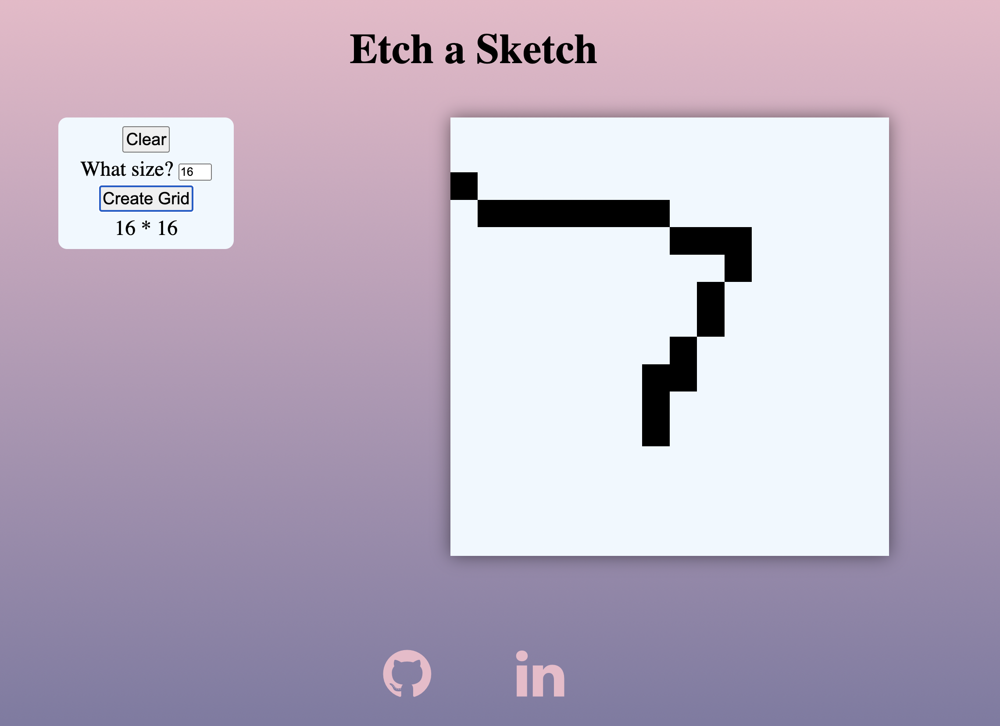

<h1 align="center">Hi 👋, I'm Tasnim Jilal</h1>
<h3 align="center">I am an aspiring software developer interested in all things programming and hobby game designer.</h3>

<h3>Who Am I?</h3>

I am a second year Uni Student at Stony Brook University. Born in Bangladesh and currently self-studying all things programming. I love programming because it allows me to express both creativity and technical skills. Looking to change into this career path soon for a brighter future.

<h3 align="left">Languages and Tools:</h3>

        

<table>
  <tr>
    <td width ='50%'>
    <h2 align='center'>The Type Game</h2>
      
  
        
      

    <td width ='50%'>
    <h2 align='center'>Calc App</h2>
      
  
        
      

  </tr>
  <tr>
    <td width='50%'>
      <h2 align='center'>Library App</h2>
      
  
        
      

    </td>
    <td width='50%'>
      <h2 align='center'>Etch-A-Sketch</h2>
      
  
        
      

    </td>
  </tr>
</table>
